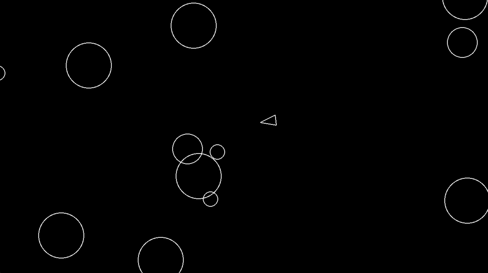

# 🪐 Asteroids

A simple clone of the classic **Asteroids** arcade game built with [Pygame](https://www.pygame.org/). Control your ship, avoid collisions, and shoot asteroids to survive!



## 🚀 Features

- Player ship with rotation and movement
- Asteroids that spawn randomly from the screen edges
- Shooting mechanic with cooldown
- Asteroids split into smaller pieces when shot
- Basic collision detection and game over logic
- Clean object-oriented structure using Pygame's Sprite system

## 🎮 Controls

| Key | Action         |
|-----|----------------|
| W   | Move forward   |
| S   | Move backward  |
| A   | Rotate left    |
| D   | Rotate right   |
| Space | Shoot        |

## 🧱 Structure

```bash
asteroids/
├── src/
│   ├── main.py            # Game loop and main logic
│   ├── player.py          # Player logic and drawing
│   ├── asteroid.py        # Asteroid behavior and splitting
│   ├── asteroidfield.py   # Spawning new asteroids
│   ├── shot.py            # Player bullets
│   ├── circleshape.py     # Base class for circular objects
│   └── constants.py       # Game settings and constants
├── requirements.txt
└── README.md
```

## 🛠️ Installation
**Clone the repository:**

```bash
git clone https://github.com/heysmtk/asteroids.git
cd asteroids
```

**Create a virtual environment (optional but recommended):**

```bash
python -m venv venv
source venv/bin/activate
```

**Install dependencies:**

```bash
pip install -r requirements.txt
```

**Run the game:**
```bash
python -m src.main
```

💡 Make sure you're using Python 3.11+ and have Pygame installed.


## 🧠 Future Ideas
- Add score tracking
- Implement player lives and respawn system
- Add sound effects and music
- Create a start menu and game over screen

### 📄 License
MIT – do whatever you want, just have fun 🚀

- Made with ❤️ by **@heysmtk**